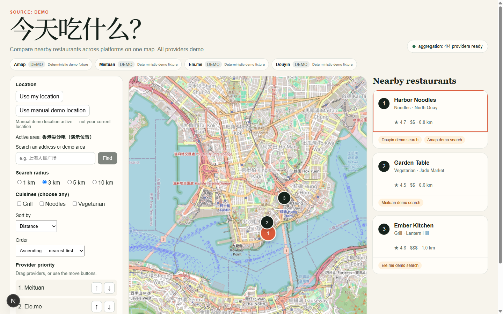
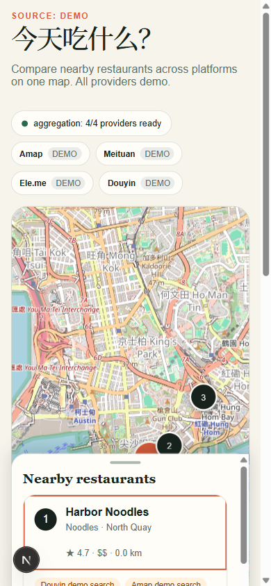

# Food Map Aggregator

A Next.js App Router and TypeScript food discovery MVP. It combines a responsive map, nearby search, cuisine/radius filters, metric sorting, and user-defined provider priority. Its safe default is deterministic and clearly labeled demo data; authorized live Amap data stays behind a server-only adapter.

[](https://vercel.com/new/clone?repository-url=https%3A%2F%2Fgithub.com%2Fjaxblack%2Ffood-map-aggregator)

## MVP capabilities

- Browser geolocation with loading, denial, error, and session-only success states.
- Manual address search through Amap when configured, or named deterministic demo areas without credentials.
- Search radii of 1, 3, 5, and 10 km.
- Cuisine filtering plus distance, rating, and average-price sorting.
- Drag-and-drop provider priority with keyboard move buttons and local persistence.
- Synchronized MapLibre markers and restaurant cards on desktop and mobile.
- Per-merchant provider links with an explicit `demo` or `live` source mode.

## Preview

| Desktop map workspace | Mobile map and result sheet |
| --- | --- |
|  |  |

## Runtime and quick start

Use Node.js 22.12 or newer in the Node 22 line and npm 10 or newer. Node 20.19+ also satisfies the current toolchain, but Node 22 is the deployment target.

```bash
cp .env.example .env.local
npm ci
npm run dev
```

Open [http://localhost:3000](http://localhost:3000). Demo mode needs no account, credential, or external service.

To build and serve below an existing host path, set the same base path at
build and runtime:

```bash
FOOD_BASE_PATH=/food npm run build
FOOD_BASE_PATH=/food npm start -- --hostname 127.0.0.1 --port 8793
```

The public qlili deployment is available at
[https://qlili.com/food](https://qlili.com/food).

## Architecture

- `src/app/` contains App Router pages and `GET /api/places`.
- `src/features/places/components/` contains the accessible explorer and persisted filter controls.
- `src/features/places/data/` contains deterministic provider fixtures used only in demo mode.
- `src/features/places/model/` defines place/provider contracts and validates local preferences.
- `src/features/places/server/` selects providers, normalizes results, and aggregates them behind one boundary.
- `src/test/` configures Vitest; `e2e/` contains deterministic Playwright journeys.

The browser never receives provider credentials. `GET /api/places` accepts `source=auto|demo|live`, `lat`, `lng`, `radius` (maximum 10000m), `limit` (maximum 25), `category`, `minRating`, and `maxPrice`. The server queries adapters and returns normalized places plus explicit aggregate and per-provider statuses. `GET /api/geocode?q=...` uses the server-only Amap key when configured; without one it matches only the documented demo areas and never invents a real address.

## Source modes

| Mode | Data source | Credentials | External network | Intended use |
| --- | --- | --- | --- | --- |
| `auto → demo` (no key) | Bundled Amap, Meituan, Ele.me, and Douyin-shaped fixtures, translated around the selected center | None | None | Development, review, automated tests |
| `auto → mixed` (key configured) | Official live Amap POIs plus explicitly demo-only Meituan, Ele.me, and Douyin adapters | `AMAP_WEB_SERVICE_KEY` | Server to Amap | MVP production mode |
| `live` API mode | Official Amap Web Service API only | `AMAP_WEB_SERVICE_KEY` | Server to Amap | Authorized provider verification |

Responses always include `sourceMode`; provider statuses and merchant links include their own mode. Explicit `live` mode never falls back to fixtures: without a valid key it returns an unavailable Amap status and no places. The automatic page mode uses demo adapters only where the corresponding live provider contract is unavailable.

## Environment variables

Copy `.env.example` to `.env.local`. Do not commit local environment files.

| Variable | Scope | Required | Purpose |
| --- | --- | --- | --- |
| `AMAP_WEB_SERVICE_KEY` | Server-only | Live mode only | Credential for the official Amap Web Service. Never rename it with a `NEXT_PUBLIC_` prefix. |

## Commands

| Command | Purpose |
| --- | --- |
| `npm run dev` | Start the local development server |
| `npm run lint` | Run ESLint |
| `npm run typecheck` | Check TypeScript without emitting files |
| `npm test` | Run deterministic Vitest unit/component tests |
| `npx playwright install chromium` | Install the E2E browser once on a workstation/CI image |
| `npm run test:e2e` | Run deterministic Chromium journeys with mocked geolocation/map tiles and blocked external traffic |
| `npm run build` | Create the production build |
| `npm start` | Serve an existing production build |

## Deploying to Vercel

1. Import the repository into Vercel and select the Next.js framework preset.
2. Leave the root directory at the repository root and the build command as `npm run build`.
3. Select Node.js 22.x in Project Settings.
4. Keep demo mode for preview deployments. For authorized mixed deployments, add `AMAP_WEB_SERVICE_KEY` as a sensitive server environment variable for the required environments; the page detects it server-side.
5. Deploy, then verify the source label and `/api/places?source=demo`. Verify live mode separately only when the provider agreement and key permit it.

No deployment command or Vercel token is required for local development.

### qlili.com subpath

The production service listens only on `127.0.0.1:8793`. Caddy preserves the
`/food` prefix when proxying because the Next.js build uses
`FOOD_BASE_PATH=/food`; do not use `handle_path`, which would strip the prefix.
`AMAP_WEB_SERVICE_KEY` is optional and belongs in the server-side systemd
environment file, never in the repository.

## Legal and operational limits

This repository does not grant rights to scrape, cache, republish, or commercially use provider data, names, trademarks, reviews, images, or rankings. Fixtures are synthetic and must remain labeled `demo`. Before enabling live mode, obtain the provider account and permissions required by its terms, respect attribution, rate, retention, and deletion rules, and review applicable map licensing and coordinate-system rules for every served region.

Browser location is optional, session-only, and requires user consent; denial leaves the manual demo location active. Do not log precise coordinates or combine them with personal data without an appropriate privacy notice and lawful basis. Provider keys must stay server-side, be restricted at the provider, and be rotated if exposed.
